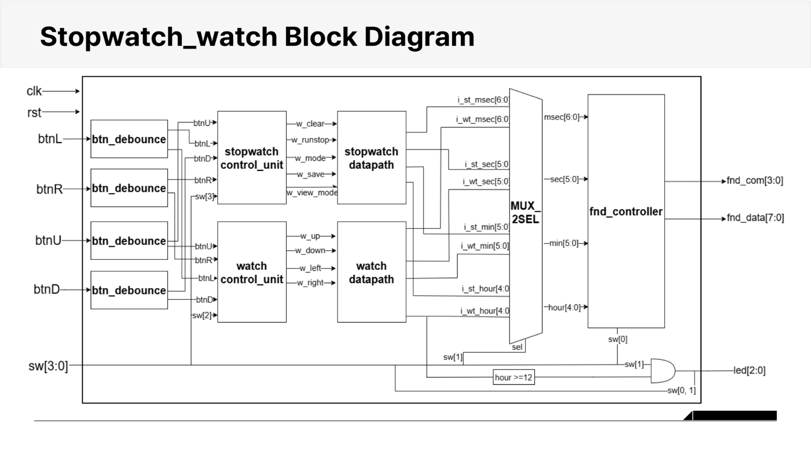
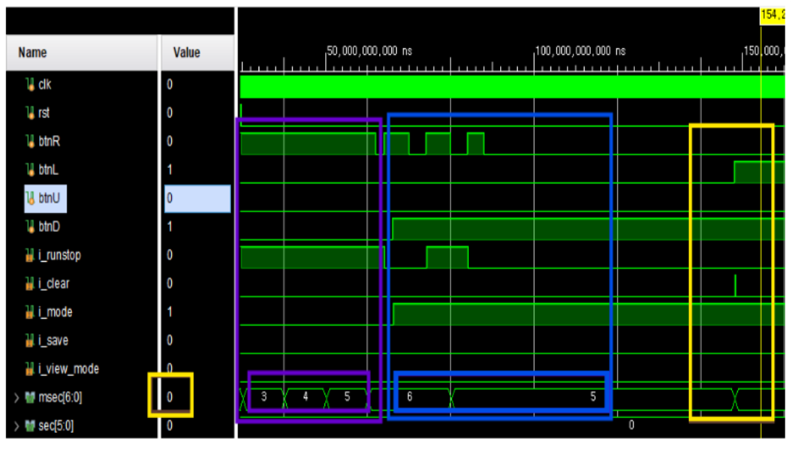
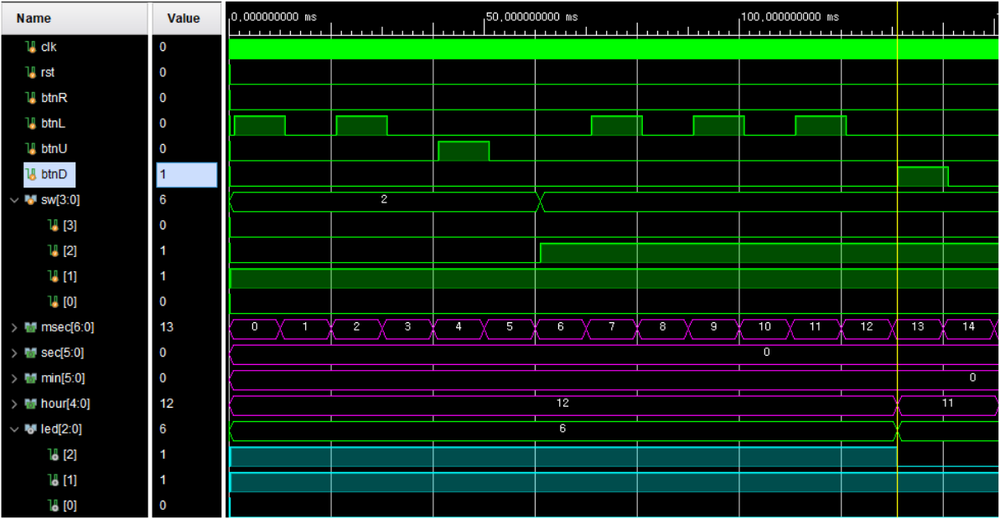
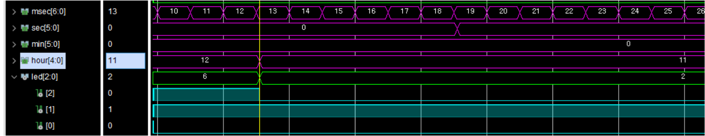
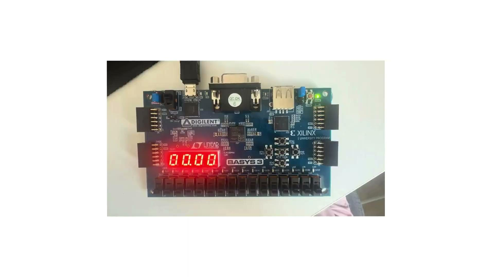

# FPGA Stopwatch & Digital Watch

Basys3 FPGA 보드에서 스톱워치와 디지털 시계를 하나의 시스템으로 구현한 프로젝트입니다. 두 기능을 각각 Control Unit과 Datapath로 나누어 설계하고, 스위치로 출력 모드를 선택하여 하나의 FND와 LED를 공유하도록 구성했습니다.

- 개발 기간: 2026.04.16 ~ 2026.04.20
- 개발 환경: Xilinx Vivado 2020.2, Vivado Simulator
- 설계 언어: Verilog HDL
- FPGA Board: Digilent Basys3
- 입력 클럭: 100 MHz
- 프로젝트 형태: 2인 팀 프로젝트

## 주요 구현 내용

이 프로젝트에서 저는 Watch 기능과 최상위 모듈 통합을 담당했습니다.

- watch_control_unit.v에서 시계 수정 모드의 버튼 제어 로직을 구현했습니다.
- watch_datapath.v에서 시간 카운터, 자릿수 선택, 시간 증가·감소 기능을 구현했습니다.
- top_stopwatch_watch.v에서 Stopwatch와 Watch의 신호를 연결하고 출력 선택 MUX를 구성했습니다.
- Watch 버튼 조작과 AM/PM LED 변화를 시뮬레이션으로 확인했습니다.
- 팀원과 함께 버튼 디바운싱 구조를 적용하고 FPGA 실보드 동작을 확인했습니다.

## 전체 구조

버튼 입력은 Debounce 모듈을 거친 뒤 Stopwatch와 Watch의 Control Unit으로 전달됩니다. 각 Control Unit이 만든 제어 신호는 Datapath에서 시간 데이터를 변경하는 데 사용됩니다. 마지막에는 sw[1] 값에 따라 두 기능 중 하나의 시간 데이터를 선택하여 FND Controller로 전달합니다.

  

## 구현한 기능

### Stopwatch

- btnR을 누르면 Run과 Stop 상태가 전환됩니다.
- btnL을 누르면 현재 시간과 저장된 Lap Time이 초기화됩니다.
- btnD를 누르면 Up Counting과 Down Counting 모드가 전환됩니다.
- btnU를 누른 시점의 시간을 별도 레지스터에 저장합니다.
- sw[3]으로 실시간 값과 저장된 Lap Time을 선택하여 확인할 수 있습니다.
- 100 Hz Tick을 기준으로 msec, sec, min, hour 순서로 Carry가 전달됩니다.

### Digital Watch

- Reset 시 초기 시간은 12시로 설정됩니다.
- 평상시에는 100 Hz Tick을 이용해 시간이 자동으로 증가합니다.
- sw[2]가 켜진 경우에만 시간 수정 버튼이 동작합니다.
- btnL과 btnR로 수정할 자릿수를 이동합니다.
- btnU와 btnD로 선택한 시간 값을 증가하거나 감소시킵니다.
- 시간이 12시 이상이면 PM 상태를 LED[2]로 표시합니다.

### 공통 기능

- 물리 버튼의 채터링을 줄이기 위해 100 kHz 샘플링과 8-bit Shift Register를 사용했습니다.
- Debounce 결과에 Rising Edge Detection을 적용하여 버튼 입력을 1클럭 펄스로 만들었습니다.
- sw[0]으로 msec/sec 화면과 min/hour 화면을 선택합니다.
- 1 kHz Scan Clock으로 4자리 FND를 순차 점등합니다.

## 설계하면서 변경한 부분

### Watch Control을 단순하게 변경

처음에는 Watch의 시간 수정 기능도 FSM으로 구성했습니다. 하지만 상태 전이와 버튼 입력 시점이 겹치면서 원하는 자릿수가 선택되지 않거나 입력이 무시되는 문제가 있었습니다.

Watch 기능은 Stopwatch처럼 여러 동작 상태를 유지할 필요가 없다고 판단했습니다. 그래서 FSM을 제거하고 sw[2]를 수정 모드 Enable로 사용하는 구조로 변경했습니다. sw[2]가 꺼져 있으면 방향 버튼 신호가 전달되지 않기 때문에 평상시에 시간이 잘못 수정되는 것도 막을 수 있었습니다.

### Lap Time 출력 경로 분리

Lap Time을 저장한 뒤에도 실시간 Counter는 계속 동작해야 했습니다. 처음에는 실시간 값과 저장값의 출력 경로가 섞이면서 저장된 시간이 안정적으로 표시되지 않는 문제가 있었습니다.

실시간 시간과 저장 시간을 각각 별도 신호로 유지하고, sw[3]을 선택 신호로 사용하는 MUX를 추가했습니다. Clear가 입력되면 실시간 Counter뿐만 아니라 Lap Time 저장 레지스터도 함께 초기화되도록 수정했습니다.

### 버튼 입력을 한 번만 인식하도록 변경

버튼의 Level 값을 제어 로직에서 직접 사용하면 한 번 눌렀을 때 여러 클럭 동안 입력이 유지될 수 있습니다. Debounce 출력에 상승 엣지 검출을 추가하여 버튼을 누를 때마다 정확히 한 번의 펄스가 생성되도록 변경했습니다.

## 시뮬레이션 및 FPGA 확인

Stopwatch에서는 Run/Stop 전환, Up/Down Counting, Clear, Lap Time 저장과 조회를 확인했습니다. Watch에서는 수정 모드가 아닐 때 버튼 입력이 차단되는지, 자릿수 이동과 값 변경이 정상적으로 수행되는지 확인했습니다.

### Stopwatch 버튼 동작

btnR 입력 후 시간이 증가하고, Mode 변경 후 감소하는 과정과 Clear 입력 시 0으로 초기화되는 과정을 확인했습니다.

  

### Watch 시간 수정

sw[2]을 활성화한 뒤 btnR로 Hour 자릿수를 선택하고, btnD를 입력하여 시간이 12에서 11로 감소하는 것을 확인했습니다.

  

### AM/PM LED

Hour 값이 12 이상일 때 LED[2]가 켜지고, 11로 변경되면 LED[2]가 꺼지는 것을 확인했습니다.

  

### FPGA 실보드 동작

Basys3 보드에서 FND 출력, 버튼 조작, Stopwatch/Watch 모드 전환을 확인했습니다.

  

## 소스 파일 구성

### RTL

- top_stopwatch_watch.v: 전체 모듈 연결과 Stopwatch/Watch 출력 선택
- button_debounce.v: 버튼 채터링 제거와 상승 엣지 검출
- control_unit.v: Stopwatch 상태 전이와 제어 신호 생성
- stopwatch_datapath.v: Stopwatch 시간 계수와 Lap Time 저장
- watch_control_unit.v: Watch 수정 버튼 입력 제어
- watch_datapath.v: Watch 시간 계수, 자릿수 선택 및 시간 변경
- fnd_controller.v: FND 자릿수 선택, 숫자 분리 및 7-Segment 출력

### 문서 및 이미지

- assets: 시스템 구조도, 시뮬레이션 파형, FPGA 실보드 사진
- docs/final-report.docx: 프로젝트 완료보고서
- docs/presentation.pptx: 최종 발표자료
- docs/schedule.xlsx: 프로젝트 일정표
- docs/development-logs: 날짜별 개발일지

## Vivado에서 실행하는 방법

1. Vivado 2020.2에서 RTL Project를 생성합니다.
2. rtl 폴더의 Verilog 파일 7개를 Design Sources에 추가합니다.
3. top_stopwatch_watch를 Top Module로 설정합니다.
4. Basys3의 Clock, Button, Switch, FND, LED 핀에 맞는 XDC Constraint를 추가합니다.
5. Synthesis, Implementation, Bitstream Generation 순서로 진행합니다.
6. 생성된 Bitstream을 Basys3에 Programming하여 동작을 확인합니다.

현재 첨부받은 원본에는 XDC Constraint와 Testbench 파일이 포함되어 있지 않습니다. 시뮬레이션과 FPGA 확인 결과는 assets와 docs 폴더에서 확인할 수 있습니다.

## 이후 보완할 부분

- Basys3 XDC Constraint와 Testbench 원본 추가
- 버튼 샘플링용 분주 클럭을 Clock Enable 방식으로 변경하여 단일 클럭 도메인으로 정리
- 반복 가능한 Self-checking Testbench 구성
- 알람과 사용자 시간 저장 기능 추가
